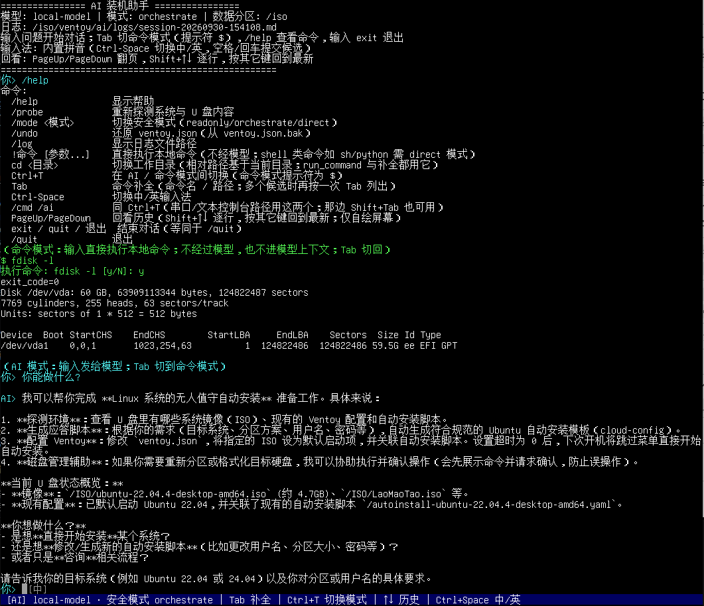

[中文](README.md) | **English**

# AI Installation Assistant (os-pilot-ai)



The AI runtime environment and agent for AI-assisted OS installation: initramfs + static Go agent +
a userspace-drawn local screen + a built-in Pinyin IME, packaged as a regular mini-ISO that boots
from the Ventoy menu.

Dependencies: **build time needs no Ventoy source** (only host tools such as
grub-mkstandalone/genisoimage/mtools plus a download cache). **Runtime relies on two conventions on
the data partition** — a data partition containing a `/ventoy` directory (mounted at `/iso`), and
`ventoy.json` (written by the `schedule_boot` tool; the unattended installation on the next boot is
executed by Ventoy's GRUB plugin).

## Documentation index

> The detailed documentation under `docs/` is currently written in Chinese.

| Document | Content |
|----------|---------|
| [`docs/AI装机入口设计.md`](docs/AI装机入口设计.md) | Entry design: custom screen, T1 entry, IME, milestones & acceptance criteria, T1 test record |
| [`docs/部署.md`](docs/部署.md) | T1 entry deployment (put the mini-ISO on the data partition) and data-partition configuration (`ai.json` / `ventoy.json`) |
| [`docs/测试.md`](docs/测试.md) | Tests & verification: host mock, QEMU end-to-end, Ventoy menu, real USB drive, toolchain, reinstall loop |
| [`docs/本地屏.md`](docs/本地屏.md) | Local-screen interaction (mode switching / history / completion) and the built-in Pinyin IME (keys & environment variables) |
| [`docs/工具与安全.md`](docs/工具与安全.md) | The 11 agent tools, the bundled toolchain, and the 3-layer protection for the disk tools |

## Repository layout

| Path | Description |
|------|-------------|
| `agent/` | Static Go agent (stdlib-only, `CGO_ENABLED=0`). Entry `main.go`: `--config/--payload/--script/--base-url/--model/--api-key/--mode/--log-dir/--no-reboot` |
| `agent/internal/{config,llm,session}/` | `ai.json` config & validation; OpenAI-compatible client (function calling, proxy); session loop, confirmation gate, JSONL+MD logs |
| `agent/internal/tools/` | 11 tools: `system_probe` `fs_read` `fs_write` `run_command` `ask_user` `schedule_boot` `list_disks` `partition` `format` `backup` `gen_autoinstall` |
| `agent/internal/disk/` | Disk domain layer (reusable by the agent tools and a future TUI/GTK/WebUI): block-device enumeration, protected-device detection, parted/mke2fs/rsync command building & argument whitelisting, structured JSON results |
| `agent/internal/screen/` | Userspace-drawn screen: VTF1 bitmap font (generated from GNU Unifont) + grid terminal emulation + fb canvas + raw line editor + Pinyin IME client |
| `ime/` | Pinyin IME helper: `pinyin-ime.cpp` (static libgooglepinyin wrapper), `build.sh`, `LICENSE` (Apache-2.0) |
| `init/` | initramfs PID 1: `init` (mount → load modules → mount data partition → DHCP → run agent → poweroff), `mount_payload.sh` (mount the partition containing `/ventoy` at `/iso`), `udhcpc.script` |
| `config/ai.json.example` | Config example (deploy as `/ventoy/ai.json` on the data partition) |
| `tools/make_font.py` | unifont.hex → font.bin (VTF1: binary-search index + 32 B/glyph, mixed-width bitmaps) |
| `tools/mock_openai_server.py` | Offline mock LLM (scripted tool_calls); `VTOY_MOCK_LOG` dumps request bodies, `VTOY_MOCK_SCENARIO=disk` for the disk scenario |
| `docs/` | Documentation (see the index above) |

`pack/` scripts (all rootless; paths resolved via `defaults.sh`):

| Script | Description |
|--------|-------------|
| `defaults.sh` | Build-path resolution layer (sourced by the other scripts): positional args > `VTOY_AI_*` env vars > `~/.config/ventoy-ai/defaults.sh` > built-in fallback outside the repo; also provides the QEMU resource defaults (KVM/memory/CPUs) |
| `build_busybox.sh` | Build a static x86_64 busybox (downloads the official source tarball + SHA256 verification by default) |
| `fetch_kernel.sh` | Download the Ubuntu 26.04 distro kernel (linux-image + linux-modules, pinned SHA256) and trim modules per `kernel-modules.list` (`.ko.zst` → `.ko`) |
| `kernel-modules.list` | Module list shipped in the initramfs (storage/filesystems/NICs/input/display; dependency closure of 59 modules) |
| `build_tools.sh` | Statically build the partitioning/formatting/backup toolchain: e2fsprogs 1.47.0 + parted 3.6 + rsync 3.2.7 (pinned source SHA256) |
| `make_font.sh` | unifont.hex → `$BUILD/screen/font.bin` (shipped with the initramfs; pack_env.sh invokes it automatically when the font is missing) |
| `pack_env.sh` | Pack the initramfs: init + agent + trimmed module tree + bitmap font + IME + toolchain (auto-generates the font when missing; only warns if the IME/toolchain are missing) |
| `make_test_disk.sh` | Create a test payload disk (ext4 with fake ISOs / answer file / ai.json, rootless via `mke2fs -d`) |
| `make_iso.sh` | Build the AI-environment mini-ISO (T1 entry) |
| `get_mtools.sh` / `find_mtools.sh` | Fetch / locate mtools without root (`mcopy`/`mmd`, needed by `make_ventoy_testdisk.sh`) |
| `make_ventoy_testdisk.sh` | Assemble a complete Ventoy test-disk image (official boot assets + self-built data partition) |
| `make_blank_disk.sh` | Create/reset a blank virtual target disk (all-zero, no partition table); **an existing file with the same name is overwritten** |
| `run_qemu.sh` | Direct QEMU boot (serial console); `VTOY_AI_INTERACTIVE=1` for interactive chat |
| `run_qemu_ventoy.sh` | Boot the Ventoy test disk in QEMU (through the real menu) |
| `run_qemu_usb.sh` | Attach a real USB drive to QEMU (needs root); refuses non-USB/mounted devices; optionally attaches a target disk |
| `run_qemu_target.sh` | Boot an **installed** target-disk image in QEMU (rootless) to verify it boots |
| `run_qemu_ime.sh` | Local-screen IME end-to-end regression (sendkey-driven; verifies the Chinese text sent to the model) |
| `run_qemu_ui.py` | Local-screen interaction end-to-end regression (QMP send-key + bitmap-font OCR, 34 assertions) |
| `verify_tools.sh` | In-guest test of the bundled toolchain (pure `!command`, 16 assertions, no LLM needed) |
| `verify_disk_tools.sh` | In-guest test of the guarded disk tools (mock LLM scenario, 30 assertions) |
| `verify_install_loop.sh` | "AI builds the disk → target distro reads it → real boot" loop (before/after contrast) |
| `verify_target_image.sh` | Read-only static criteria for an installed target disk ("can it boot") |

## Building (rootless, entirely outside the repo)

The build directory is resolved by `pack/defaults.sh` with this precedence: **positional args >
`VTOY_AI_BUILD_DIR` env var > machine-local `~/.config/ventoy-ai/defaults.sh` > built-in fallback
`${XDG_CACHE_HOME:-$HOME/.cache}/ventoy-ai`**. Keep machine-private paths in the local file, never
commit them:

```sh
# ~/.config/ventoy-ai/defaults.sh
export VTOY_AI_BUILD_DIR=/path/to/ventoy-ai-build
export VTOY_AI_BUSYBOX_SRC=/path/to/busybox-1.36.1    # optional; downloads the official tarball if unset
export VTOY_AI_VENTOY_RELEASE=/path/to/ventoy-1.1.05  # only needed by make_ventoy_testdisk.sh
```

```sh
AI=$(pwd)                        # repo root; examples assume you are in the repo root
BUILD=/path/to/ventoy-ai-build   # resolved as above when unset; $BUILD below is the build directory

# 1) agent (output: agent/os-pilot-ai inside the repo, gitignored; the bitmap font is NOT embedded
#    in the binary — it is generated/packed by pack_env.sh in step 6)
$AI/agent/build.sh

# 2) static x86_64 busybox (downloads the official busybox-1.36.1 tarball + SHA256 check;
#    point VTOY_AI_BUSYBOX_SRC at an existing source tree to skip the download)
$AI/pack/build_busybox.sh

# 3) distro kernel (Ubuntu 26.04 LTS, 7.0.0-34-generic; Tsinghua mirror + pinned SHA256 by default)
#    outputs $BUILD/kernel/vmlinuz and a module tree trimmed per kernel-modules.list
#    (.ko.zst decompressed to .ko at pack time)
$AI/pack/fetch_kernel.sh

# 4) built-in Pinyin IME (optional; outputs $BUILD/ime/{pinyin-ime,dict_pinyin.dat})
#    libgooglepinyin (Apache-2.0) fully static; if missing, pack_env.sh only warns and the
#    agent degrades to no-IME
sh $AI/ime/build.sh

# 5) partitioning/formatting/backup toolchain (optional but recommended; outputs
#    $BUILD/tools/{mke2fs,e2fsck,resize2fs,tune2fs,dumpe2fs,parted,rsync})
#    source tarballs are cached in $BUILD/dl/, reruns do not re-download
sh $AI/pack/build_tools.sh

# 6) pack the initramfs (init + agent + trimmed module tree + bitmap font + IME + toolchain)
#    generates the font via pack/make_font.sh when missing (apt-downloads GNU Unifont;
#    offline: VTOY_FONT_HEX=<unifont.hex> sh pack/make_font.sh first)
$AI/pack/pack_env.sh

# 7) create the test disk (ext4 payload with fake ISOs / answer file / ventoy.json / AI env files)
$AI/pack/make_test_disk.sh

# 8) build the AI-environment mini-ISO (T1 entry; output $BUILD/test/0-OS-PILOT-AI.iso, ~46 MB)
$AI/pack/make_iso.sh

# 9) fetch mtools without root (mcopy/mmd, only needed by step 10; skip if the host PATH has mtools)
sh $AI/pack/get_mtools.sh

# 10) assemble the full Ventoy test-disk image (optional; for "real Ventoy menu" end-to-end tests)
sh $AI/pack/make_ventoy_testdisk.sh
```

See [`docs/测试.md`](docs/测试.md) for the test & verification workflow, and
[`docs/部署.md`](docs/部署.md) for deploying to a real USB drive.

## Status & known limitations

Verified on QEMU (x86_64) and a real USB drive: boot → mount data partition → DHCP → multi-turn Q&A
with tool calls → write `ventoy.json` → persist logs → poweroff; the T1 menu loop (zero Ventoy code
changes); userspace screen on real UEFI GOP plus Pinyin Chinese input; the bundled toolchain and the
guarded disk tools pass in-guest tests; **the real-machine reinstall loop works end-to-end** (Ubuntu
22.04 installed onto an AI-built disk; `verify_target_image.sh` 8/8 and `run_qemu_target.sh` boots
to gdm3). Per-round test records are in [`docs/测试.md`](docs/测试.md); milestones, acceptance
criteria and the T1 test record are in [`docs/AI装机入口设计.md`](docs/AI装机入口设计.md) §13 / §4.4.

Known limitations:

- Automated regressions mostly use a mock LLM; a real model endpoint (Qwen family) has been verified on real hardware, but function-calling compatibility with other vendors' endpoints has not been checked one by one
- Verified on x86_64 only (QEMU + real USB); ARM64 is untested
- The T3 menu entry is not yet wired into `INSTALL/grub/grub.cfg` or the build pipeline (`INSTALL` / `GRUB2` packaging)
- Disk tools currently format ext2/3/4/vfat only (no exFAT/NTFS tooling); partition/format/backup end-to-end against **a real USB drive itself** (including hot-plug) is untested
- `direct` mode (skip confirmations), encrypted key storage, and rollback strategies beyond `/undo` lack end-to-end verification

## License

The code authored in this repository is **Apache-2.0** as of 2026-09-30 (full text in
[LICENSE](LICENSE)); earlier commits (up to `97c31d8`) were released under GPL-3.0-only and remain
valid and irrevocable for those who obtained them. This repository neither links against nor
contains Ventoy source code; it cooperates only through public conventions — reading/writing
`ventoy.json` on the data partition, whose configuration is executed by Ventoy's GRUB plugin on the
next boot.

**External contributions**: the repository has a single author and no CLA yet; before accepting
external PRs, agree on a "contributions are relicensable" term to preserve the ability to switch
the license (including to closed source) in the future.

Third-party components pulled in at build time (none are committed to the repository; artifacts are
distributed with the initramfs/ISO under their own terms, unaffected by this repository's license):

| Component | License | How it is used |
|-----------|---------|----------------|
| GNU Unifont | GPL-2.0-or-later (with font embedding exception) | `pack/make_font.sh` generates `$BUILD/screen/font.bin`, shipped as a **standalone data file** with the initramfs (not embedded in the agent binary; source & license in `/ventoy/ai/screen/LICENSE.unifont` inside the package) |
| busybox 1.36.1 | GPL-2.0-only | `pack/build_busybox.sh` downloads and builds the official source |
| Linux kernel & modules (Ubuntu distro packages) | GPL-2.0-only | `pack/fetch_kernel.sh` downloads and trims per the module list |
| libgooglepinyin | Apache-2.0 | `ime/build.sh` builds the helper statically; full terms in [ime/LICENSE](ime/LICENSE) |
| e2fsprogs 1.47.0 | GPL-2.0-or-later / LGPL-2.1 (libuuid) | `pack/build_tools.sh` (kernel.org sources, SHA256-pinned) |
| GNU parted 3.6 | GPL-3.0-or-later | Same as above (libuuid from the e2fsprogs tree; libblkid statically linked from the host) |
| rsync 3.2.7 | GPL-3.0-only | Same as above (bundled popt/zlib source trees) |
| GRUB (standalone bootloader) | GPL-3.0-or-later | `pack/make_iso.sh` invokes the host `grub-mkstandalone` |

All of the above form a **mere aggregation** with the first-party code: packaged and loaded
independently, none is a derivative work of the others. The font data in particular has been
**externalized** from the agent binary (`/ventoy/ai/screen/font.bin`, loaded from disk at runtime);
shipping copyleft components on the distribution medium does not bring first-party code under their
licenses.
